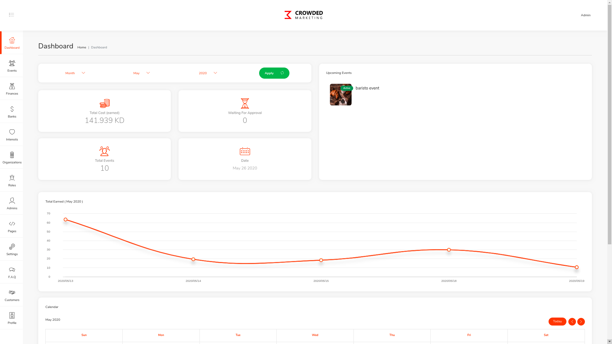

# Crowded Marketing (panel)

Heading to the address <https://panel.crowded.dev.nizek.com> you'll find yourself in a login page you may pass as an *admin*

Where the panel itself has many different parts and functionalities, it's important to first know the answer to these two questions:
- What capabilities does the panel have?
- Who can use it?

___

## What capabilities does the panel have?

- Basics
  - Authentication and Authorization
  - Statistics (Reading from the data)
  - Mutations (Create, update and deleting the data)

## Who can use it?

*Crowded Marketing Panel* is a multi-user piece of software, meaning that not only many *admins* can work with it, they are many layers of them
Where as we want this panel to be able to manage *finances*,*users*, *events* and other things attached to these three concerns, not anyone should be able to do anything.

So a short answer to *Who can use it?* would be:
- *Super Admin*(s)
  - Has access to almost anything, can view/alter all the information and can assign permissions to others
- *Agent*s
  - They are technically at the lowest level of this hierarchy, sure they can manage their own work but they can't alter/view others' (eg. an agent doesn't/shouldn't have access to financial reports from another agent)
- *Organization Admin*s
  - Agent's can be promoted to be the manager of the *organization* they're currently assigned to, by that, they'll become able to not only doing they're own job, but alter/viewing other agents' work as long as they're on the same organization.

this might sound a bit confusing,
___

## What is an organization?
An organization is basically a group where admins belong to, defined in it's own place, partitioning *finances*, *events* etc.
Considering *organization X* as an example, *X* is in fact the name of a corporation, typically holding a many event's every month, Well, not all their events are held by a single person and more important than that, *X* cannot create a new event cause it's not an *admin*!, it's an *organization*, therefore *X* can have many *agents*/*organization-admins*, so that the information will be managed (by the organization-admin) and will be altered/views by the agents of it's own.

**summary**
- Organization X
  - Agents
    - Agent A (org-admin-level permissions)
    - Agent B (agent-level permissions)
    - Agent C (agent-level permissions)

___

## Different parts to the panel 

### Account Management
As an admin, you can manage your own information/credentials in the last tab called *profile*, simple and straight forward.

### Dashboard
No matter what *role* you have, there's always a dashboard there that suits you, for a *super-admin* it will show information like *Total Earn*, *Total Events* and so on where as a low-level *agent* all you can see *Total Paid* instead of earn, for *organization-admins* it's again slightly different.

### Events
This is the core to the whole project, you as an admin can *create* and *update* events, *delete* or *search* through them
an event 

### Finances
As people *attend* to your event's, *show-up* and *stay* for an already set amount of time, **they should be paid**.
This tab is there you can see records of *debts* alongside with information about the *creditor user* and after payment (outside of this panel), you may change the status of that *debt* to *paid*, they'll be notified.

## Banks (super-admin-only)
As people sign up in your applications (Android/IOS), they can/should provide information about their bank-accounts so that we'll be able to actually pay them.
When an app user want's to add a bank-account, they can select their *bank-name* from a list in a form shown to them.
This tab is where you can define those banks, so that they can pick one of them where as you have added them to the list as a sign of *approval* and *safety*.

## Interests (super-admin-only)
At the other side, when a user logs into our mobile-apps, the very first thing they is a list of interests they can pick from, (eg. Sports, Tech, Music, Architecture etc.), in this tab you can define the available/optional list of interests.

## Organization (super-admin-only)
you can manage organizations from here.

## Roles (super-admin-only)
This is he answer to all the terms *super-admin*,*organization-admin*,*agent* etc.
There will be loads of information on our server and we want everyone to be just able to do their own thing, but we want this process to be as flexible as possible, therefore you can always have your own custom roles, now inside of a role many permissions are defined, you'll find a form containing:
- Detail box
  - Simply, title of the role goes here
- Different categories of information
  - ADMIN
  - USER
  - ACCOUNT
  - BANK
  - ORGANIZATION
  - ROLE
  - TRANSACTION
  - FAQ
  - INTEREST
  - EVENT (multi-level)
  - PARTICIPANTS (multi-level)
  - REPORT (multi-level)
  - SETTINGS
  - PAGE
  - PROFILE
Now for each role you can simply declare if the "assignee" to that role can has access to each of four basic types of action on an specific part/tab
eg, we can define a role called *reports-only* and just permit actions under that category.
but as you see some boxes have tabs in them, that's to manage the border between *super-admins*, *organization-admins* and *agents*, managed by levels of *any*, *group* and *own*, so that an agent has only access to their own data, *organization-admins* have access to all data in their organization and *super-admins* have access to all the data.

## Admins (super-admin-only)
In here as a *super-admin* you may alter/view the information about all admins, you can add new ones, alter access levels, change/set corresponding organization of an admin.

## Pages (super-admins-only)
Some pages shown in the apps (Android/IOS) are dynamic, which means they should be changable from the admin-panel, in here you can see a list of those pages, were as for now there's only an *about-us* page which you can change the content of.

## Settings (super-admins-only)
This is important, you can change some variables from here but beware that they WILL actually make a change in process, (eg. changing the *support-email* will cause support messages to be headed to the new given email address) 

## FAQ (super-admins-only)
*Frequently asked questions* must be dynamic, that being said we need a place to add/edit/delete them. this is the place.

## Customers (super-admins-only)
Here you have access to your *end-users*, meaning *users of the apps*, further in detail, you can see their profile picture, profile information, events they've attended to, their reports and their bank-account information.

## Profile
Personal account information, individually for the logged-in admin.

